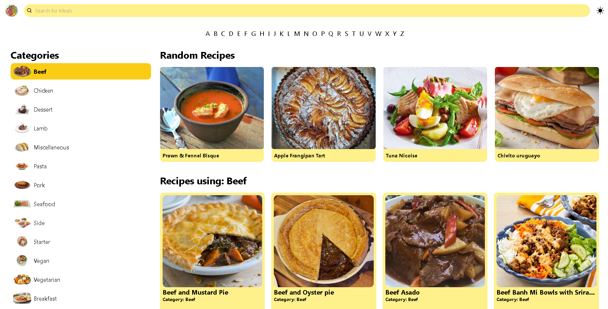

# Arisetechnology Test

### Layout



### 🧠 About

Projeto para a vaga de Desenvolvedor Front-end da Arisetechnology, com o objetivo de criar uma landing page com as seguintes funcionalidades:

- Site responsivo de receitas que o usuário consiga buscar receitas por nome, primeira letra e ingredientes.
- As receitas devem ser obtidas da API TheMealDB.

### Core technologies

- Vite
- ReactJS
- React Icons
- TailwindCSS
- Typescript
- Antd

### 🖥️ Installation

1. Clone this repo
```bash
https://github.com/delanoquirino/test_arisetechnology.git
```

2. Install dependencies
```bash
npm install
```

3. Run Frontend
```bash
npm run dev
```


